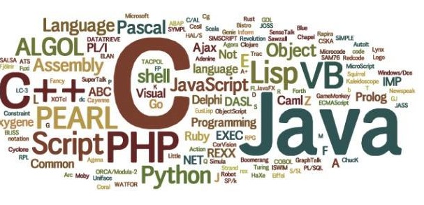

# Mitigation-And-Analysis

*Mitigation-And-Analysis* It is a repository that carries some vulnerabilities in an open source form for the code, as well as some codes and ideas in an attempt to mitigate your code from some security vulnerabilities
**There will also be some code analysis**

>It is worth noting that all the codes focus on one programming language so far, which is **php**, and some other languages will be added soon, God willing . 

 

---
### The languages we look forward to working on in the future .
- [X] PHP
  -  [ ] Laravel
- [X] JS
  - [ ] Node.js
- [ ] GO
- [ ] Python
  - [ ] Django
- [ ] CPP
- [ ] C

---
### Our future plan
- >Some of the ideas of PortSwigger Labs will also be added as code, and this is done by **analyzing the behavior of the web application**
We will **guess the shape of their code in the backend**
This is for the ease of modification by you and **learning some of the details that are in the backend**

---
***
___

## Author

Mohammed Khalid (0xDARK)
 

## Contacts
 **Facebook** 
* [Mohammed Khalid](https://www.facebook.com/profile.php?id=100085121092587)

 **Twitter** 
* [0xDARK3](https://twitter.com/0xDARK3)

 **Linkedin** 
* [Mohammed Khalid](https://www.linkedin.com/in/mohammed-khalid-3b43a51b3?fbclid=IwAR0LdK7KAb_etFC8qdXQBg-9ApWOfxNZHY1CwuVUe52AgpycPZcdUU9-pt0)

 

 **Medium** 
* [0xDARK](https://medium.com/@0xDARK)
